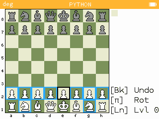

# μSunfish Chess for the NumWorks
Chess game for the NumWorks calculator in micropython based on Sunfish

The [Sunfish engine](https://github.com/thomasahle/sunfish) has been [ported to micropython](https://github.com/fizban99/numworks_usunfish) to be able to work decently on devices with limited memory.

It has 7 levels of difficulty (use Ln to change levels or "N" on the desktop) and you can undo the last move (only the last one, with backspace).
Use Pi (or "P" on the desktop) to switch to black (rotates the board and makes the engine move) 
You select the piece to move with the cursor keys and OK (or "Enter" on the Desktop). You can cancel the move selecting again the piece.

Requires the usunfish_chess.py, usunfish_engine.py, usunfish_data.py and usunfish_gmv.py to be also loaded.
This version can be run on a PC.

You can find a simplified minified NumWorks version at [my repository - usunfish_chess](https://my.numworks.com/python/fizban/usunfish_chess) and [my repository - usunfish_engine](https://my.numworks.com/python/fizban/usunfish_engine). You have to send both files to the calculator and execute usunfish_chess.py

You can play directly on your browser thanks to pyodide integration of pygame (it takes some time for the initial load):
[online NumWorks uSunfish](https://fizban99.github.io/numworks_usunfish/app)

## Features
- 7 levels of difficulty based on a maximum of nodes evaluated (from around 125 in level 0 up to around 8000 nodes in level 6)
- Reduced memory footprint by extensively using some micropython features such as string interning and 31-bit smallints and removing the object-oriented approach of the original Sunfish.
- It uses a small hash table to reduce node traversal time during sequential iterations of the iterative deepening MTD-bi search. The table stores only fail-high moves and employs a simple age-based replacement algorithm.
- It includes a small opening book of 1,613 plies derived from the [Balsa_270423.pgn](https://sites.google.com/site/computerschess/balsa-suite-270423) and [Unique v110225](https://sites.google.com/site/computerschess/unique-suite-110225) openings files.
- As a reply of non-common openings, it has 5 different answers to non-common starting positions using the 400 moves.pgn file from [https://www.scacchi64.com/downloads.html](https://www.scacchi64.com/downloads.html)
- The highest difficulty level is calibrated to approximately 2100 Elo when playing against the Stockfish engine configured to simulate that rating. At this strength, it easily defeats the [badger2040 port](https://github.com/niutech/chess-badger2040).
- This version incorporates 
    - Additional mobility evaluation, including double bishops, open/semiopen files, king safety and advanced pawns.
    - Enhanced but basic move ordering with
        - Promotions and captures first, following a simplified MVV-LVA (Most Valueable Victim - Least Valuable Aggressor)
        - Killer moves second
        - History heuristic third
        - Under promotions and non-history quiets last
    - Basic Late Move Reduction (LMR) 
    - Agressive forward and reverse futility pruning.
- The pst and mobility tables have been tuned using the quiet-labeled.v7.epd positions file using the L-BFGS-B algorithm of the scipy library.
- Instead of a string, the board is a 64-item list that is part of the global position. Although a list to store the board is memory-hungry, its updatable and faster for restoring the difference when returning from a recursive call.
- Besides the original [Sunfish](https://github.com/thomasahle/sunfish), this engine also draws inspiration on [MinimalChess](https://github.com/lithander/MinimalChessEngine),  [4ku](https://github.com/kz04px/4ku) and [MadChess](https://www.madchess.net/)
- You can also play against [level 0](https://lichess.org/@/uSunfish-l1) and [level 6](https://lichess.org/@/uSunfish-l7) on lichess. There is also a special [easier level](https://lichess.org/@/uSunfish-l0).