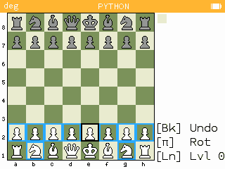

# uSunfish Chess for the NumWorks
Chess game for the NumWorks calculator in micropython based on Sunfish

The Sunfish engine has been ported to micropython to be able to work decently on devices with limited memory.

It has 6 levels of difficulty (use Ln to change levels or "N" on the desktop) and you can undo the last move (only the last one, with backspace).
Use Pi (or "P" on the desktop) to switch to black (rotates the board and makes the engine move) 
You select the piece to move with the cursor keys and OK (or "Enter" on the Desktop). You can cancel the move selecting again the piece.

Requires the usunfish_engine.py to be also loaded in the calculator.
This version can be run on a PC.

You can find the minified NumWorks version at https://my.numworks.com/python/fizban/usunfish_chess and https://my.numworks.com/python/fizban/usunfish_engine. You have to send both files to the calculator and execute usunfish_chess.py

You can play directly on your browser thanks to pyodide integration of pygame:
https://fizban99.github.io/numworks_usunfish/app

